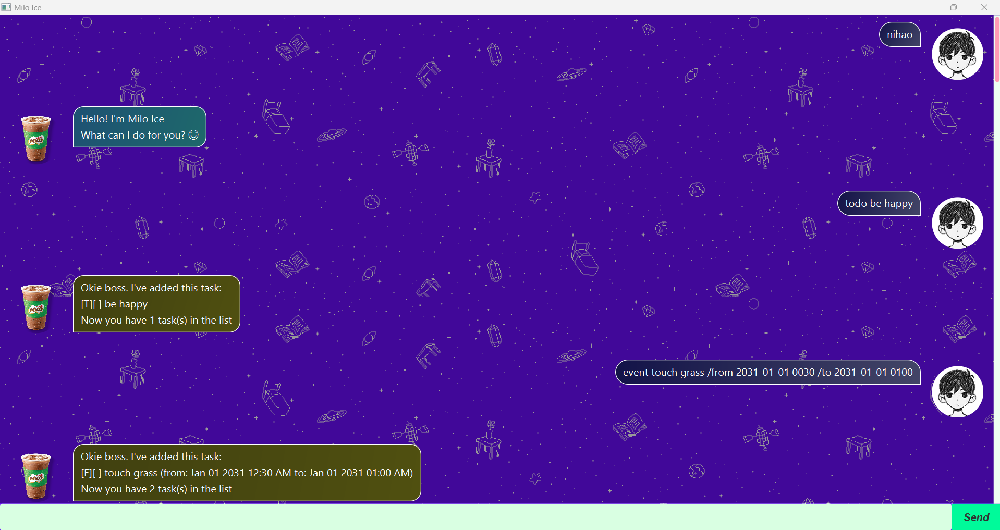
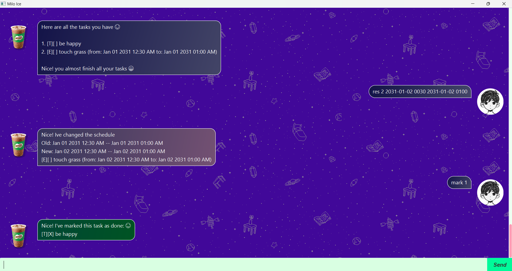

# Milo Ice User Guide

## Sample GUI Screenshots
**Here are some screenshots of Milo Ice:** <br>
 <br>



## Introduction
Milo Ice is a task management bot designed to keep you organized and on track with all your tasks, and
it enables you to manage 3 types of tasks, `Todo`, `Deadline`, `Event`.
Features provided are adding, marking, unmarking, deleting, and searching for tasks.
With built-in storage, Milo Ice ensures that your tasks are saved and accessible even after you close the app.  

## Adding todo : `todo`

- Add todo task which only consist of a description.
- The task will be added to the task list with a tag `T`.

Format:
`todo <task description>`

Example:
`todo be happy`

Outcome:
`be happy` Todo task is added to the task list with a tag `T`
and by default it is not marked as done.

```
[T][ ] be happy
```

## Adding deadlines : `deadline`

- Add deadline which consist of a description and deadline.
- The task will be added to the task list with a tag `D`.

Format:
`deadline <task description> /by <yyyy-MM-dd HHmm>`

Example:
`deadline Write user guide /by 2025-02-21 2359`

Outcome:
`Write user guide` Deadline task is added to the task list with a tag `D`
and by default it is not marked as done.

```
[D][ ] Write user guide (by: Feb 21 2025 11:59 PM)
```

## Adding events : `event`

- Add event which consist of a description, start and end date & time.
- The task will be added to the task list with a tag `E`.

Format:
`event <task description> /from <yyyy-MM-dd HHmm> /to <yyyy-MM-dd HHmm>`
- The start time must precede the end time.

Example:
`event party /from 2025-02-22 1600 /to 2025-02-22 2200`

Outcome:
`party` Event task is added to the task list with a tag `E`
and by default it is not marked as done.

```
[E][ ] party (by: Feb 22 2025 04:00 PM to: Feb 22 2025 10:00 PM)
```

## Listing all the tasks : `list / ls`

- List out all the task and their corresponding number/index.

Format: `list` or `ls`

Example Outcome:
```
1. [T][ ] be happy
2. [D][ ] Write user guide (by: Feb 21 2025 11:59 PM)
3. [E][ ] party (by: Feb 22 2025 04:00 PM to: Feb 22 2025 10:00 PM)
```

## Marking / Unmarking a task as done : `mark / unmark`

- Mark / unmark the task with a given index `i` from the user.
- The `i`<sup>th</sup> task in the list is marked as done / marked as NOT done.

Format:
`mark <task number/index>` `unmark <task number/index>`

Example:
`mark 1`

Outcome: The 1<sup>st</sup> task in the task list is marked as done.
```
Nice! I've marked this task as done:
[T][X] be happy
```

## Deleting tasks : `delete`

- Delete the task with a given index `i` from the user.
- The `i`<sup>th</sup> task in the list will be removed regardless it is marked or not.

Format:
`delete <task number/index>`

Example:
`delete 1`

Outcome:
The `<task number>`<sup>th</sup> task is removed from the task list.

```
I've removed this task:
[T][X] be happy
```

## Finding a task : `find`

- find tasks whose descriptions contain the given keyword as a substring.
- not case-sensitive.

Format:
`find <keyword>`

Example:
`find book`

Outcome: list out all the tasks that match the keyword.
```
Here are the matching tasks in your list:
1. [T][ ] book hotel
2. [D][ ] reBooK MBS hotel
```

## Additional Features
1. **Rescheduling** deadlines and events : `reschedule / res`
   - Format: 
     - Deadline: `res <task number> <new deadline>`
     - Event: `res <task number> <new start time> <new end time>`

2. Exit the app : `bye`

## Note
- Don't worry if you forget the format, Milo Ice will show you the correct format :)